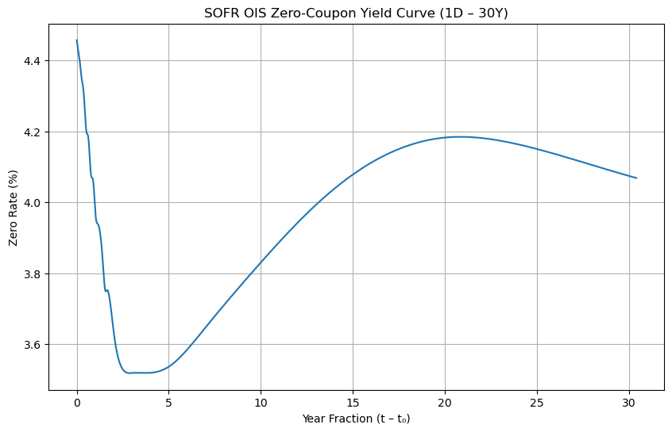
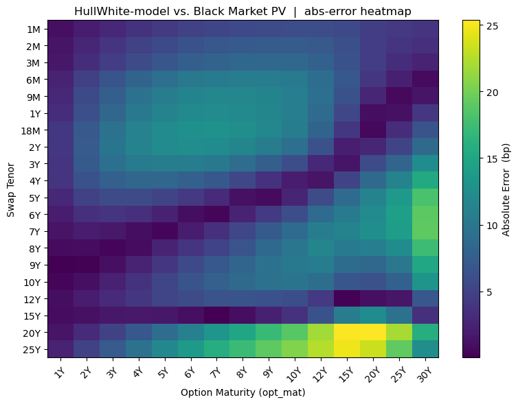
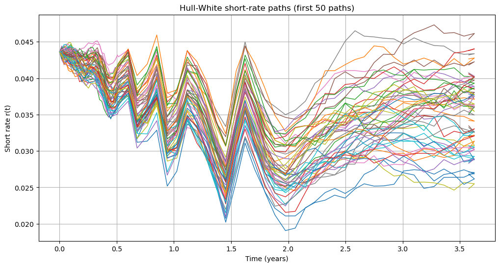
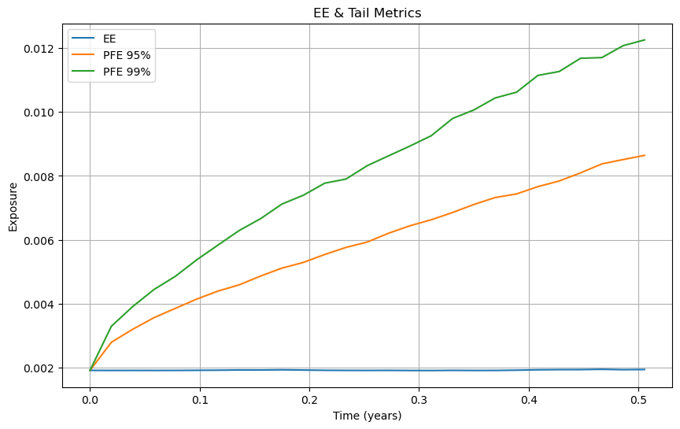
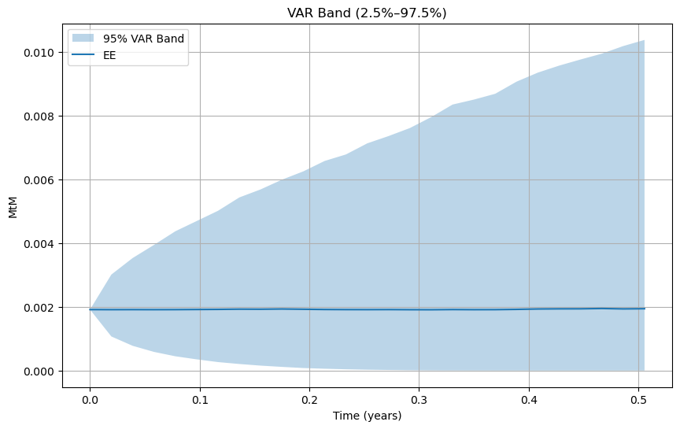
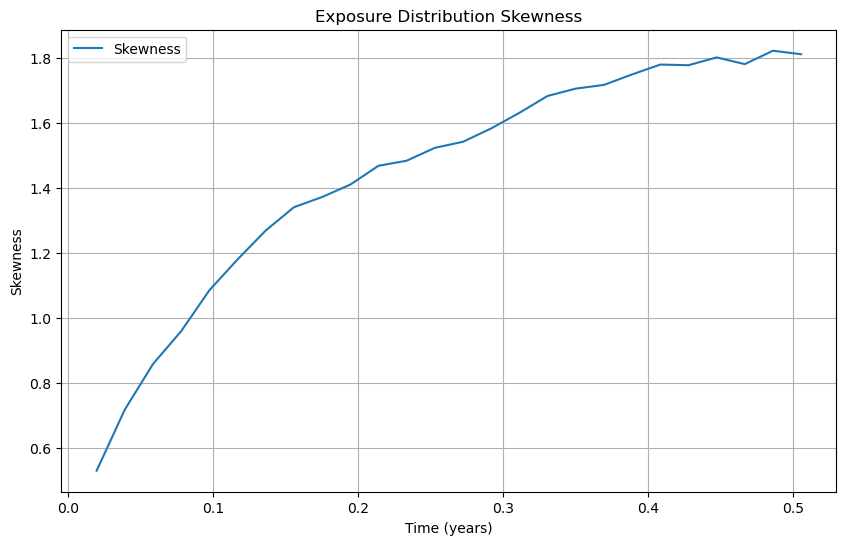
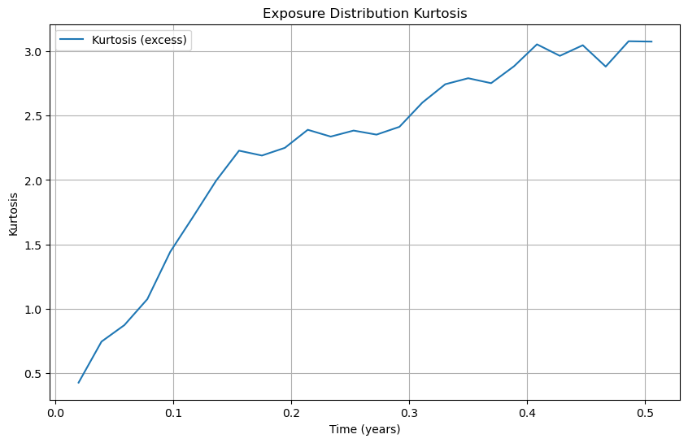

# SOFR Swaption Pricer & Exposure Engine

The Secured Overnight Financing Rate (SOFR) has replaced LIBOR as the benchmark rate for USD interest‑rate derivatives. Swaptions are important interest‑rate options whose pricing and exposure measurement are critical for risk management and asset/liability management. This project demonstrates pricing and exposure analysis for SOFR swaptions using QuantLib and Python.  The included Jupyter notebook walks through loading market data, building the SOFR curve, calibrating a model, valuing swaptions, and simulating exposures with MonteCarlo Simulations.

## 1. Market Data and Pre‑processing

- **OIS_Swaption_Vol_20250725.csv** – swaption Black volatility matrix as of 2025‑07‑25. (Derived from Bloomberg)
- **SOFR_OIS_Fut_data.csv** – SOFR OIS futures and swap rates for several tenors of 2025-07-25. (Derived from Bloomberg)
 
## 2. Framework and Technical Details

The notebook is organized into four major components:

1. **Curve Construction** – SOFR OIS futures and swaps are converted to rate helpers and stitched into a `PiecewiseLogCubicDiscount` curve that supports extrapolation for long-dated cash flows.
2. **Model Calibration** – A one‑factor Hull–White model is calibrated to the normal volatility surface using a Jamshidian swaption engine and nonlinear least‑squares to fit the mean‑reversion (`a`) and volatility (`σ`) parameters.
3. **Swaption Pricing** – Closed‑form Black‑76 values are compared with Hull–White model prices.  Path‑wise valuation relies on Jamshidian decomposition to handle callability along each simulated path.
4. **Exposure Engine** – Hull‑White short‑rate paths are generated with a `GaussianPathGenerator`.  Each path reprices the swaption and underlying swap. Finally, a list of exposure metrics is generated and visualized.

### 2.1 Curve Construction 
The zero‑coupon discount curve is bootstrapped in two stages:

1. **Short end (up to 1 year)** – built using SOFR OIS and futures prices, converting futures quotes to discount factors and rates (with convexity adjustments where needed).
2. **Long end (beyond 1 year)** – built from SOFR OIS swap rates, matching the fixed‑floating par rate condition.

The resulting curve is used both for discounting and forwarding. Figure 1 shows the SOFR OIS zero‑coupon yield curve built from the dataset. Short‑term rates (1D–6M) drop from about 4.45 % to 3.5 % and then gradually rise toward 4.2 % by 20 years.

Consistency checks ensure that the curve is arbitrage‑free:
*repricing errors for all helpers are below 0.01 bp,
*discount factors decrease with maturity and remain positive,
*forward rates over [0,1M] are consistent with OIS quotes to within 0.5 bp.

### 2.2 Models

**One-factor Hull–White model：** The one-factor Hull–White model assumes the short rate follows a mean-reverting Ornstein–Uhlenbeck process

$$
\mathrm{d}r(t) = \bigl[\theta(t) - a\,r(t)\bigr]\,\mathrm{d}t + \sigma\,\mathrm{d}W(t),
$$

with mean-reversion speed $a$, volatility $\sigma$ and a time-dependent drift $\theta(t)$ implied by the initial discount curve. The model gives a closed form for zero-coupon bond prices:

$$
P(t,T) = A(t,T)\,\exp\{-B(t,T)\,r(t)\}.
$$

**Jamshidian’s decomposition:** It expresses a European swaption as a portfolio of bond options. A least‑squares calibration procedure minimises the sum of squared differences between Hull–White model PVs and the market PVs derived from the Black‑76 formula to obtain optimal.

### 2.3 Calibration Evaluation

Model prices are computed across all option‑maturity and swap‑tenor combinations and compared against market PVs. Figure 2 displays the absolute pricing errors for the one‑factor Hull‑White model. Errors are small (1–5 bp) for short maturities but exceed 20 bp for long options and long tenors, demonstrating the limitations of a single‑factor model. The overall RMSE is approximately 8 bp.

### 2.4 Exposure Engine

After calibration, a Monte Carlo engine quantifies the swaption’s future exposure profile under the Hull-White model. The steps are:

**1. Time grid** – separate step sizes in the option period (e.g. weekly) and in the swap period (e.g. monthly).

**2. Short-rate paths** – sample $n$ paths of the Hull–White process using a Gaussian path generator (optionally with Sobol sequences and Brownian bridges).

**3. Pathwise pricing** – evaluate the swaption value and the underlying swap value at each time along each path via Jamshidian’s decomposition.

**4. Exposure metrics** – compute the positive exposure $\max(V(t),0)$ along each path and derive:

- **Expected exposure** $\mathrm{EE}(t)$,
- **Effective EE** $\mathrm{EEE}(t) = \max_{s\le t} \mathrm{EE}(s)$,
- **Potential Future Exposure (PFE)** quantiles,
- **Expected Shortfall (ES)** above the PFE,
- **Value-at-Risk (VaR)** band (e.g. 2.5–97.5 % quantiles),
- **Wrong-way risk (WWR) correlation** $\rho_t = \mathrm{corr}(\max(V(t),0), r(t))$,
- **Skewness and kurtosis** of the exposure distribution.

## 3. Demonstration

Here demonstrates the result of a swaption which expires in 6 Months and its tenor for swap is 3 years.

### Short-rate paths

Figure 3 plots sample Hull‑White short‑rate paths used in the exposure simulation. Rates start around 4.3 %, fall to about 2 %, and then revert toward 3.5–4.5 %, illustrating the mean‑reverting nature of the model.

### Exposure profile and tail risk

Figure 4 shows the expected exposure curve and the 95 % and 99 % potential future exposure (PFE). Because the example swaption is at the money, EE remains small (~0.002), while the PFE bands widen over time, indicating growing tail risk.

A complementary view is provided by the 95 % Value‑at‑Risk band in Figure 5, where the shaded region denotes the interquartile range of mark‑to‑market values and the line shows the EE. The band widens steadily, highlighting how dispersion increases even when average exposure is flat.

Figures 7 and 8 depict the skewness and kurtosis of the exposure distribution. Both increase materially: skewness grows from about 0.5 to over 1.8, and kurtosis from around 0.4 to 3.0. This highlights the increasingly asymmetric and heavy‑tailed nature of exposures over time.

  
## Next Steps

The notebook can be extended with scenario analysis, stress testing, or additional risk metrics to support more comprehensive risk management.
